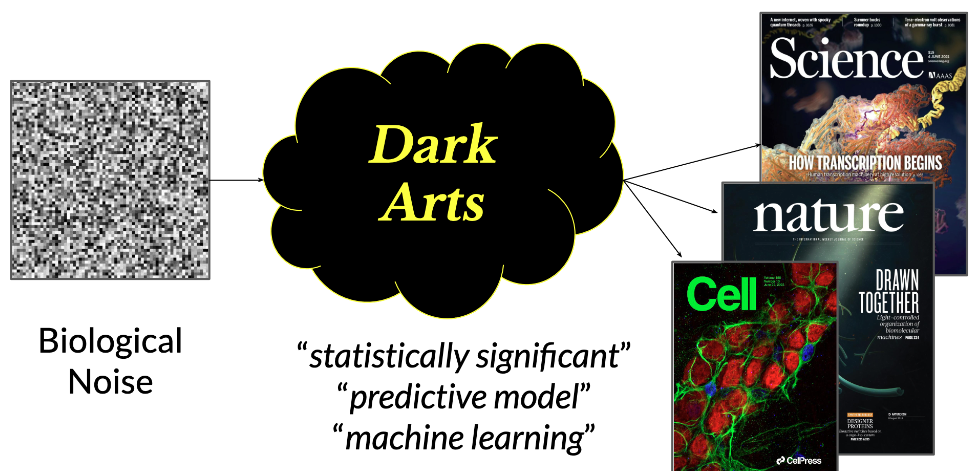

# BCB 731: Critical readings in biomedical statistics and machine learning 

BCB 731 (a.k.a *Defense Against the Dark Arts*) is a survey of recurring statistical errors and pitfalls which are sometimes used to exaggerate the weight of evidence for novel biological claims or inflate the
estimated accuracy of proposed predictive biomedical models. This course focuses on misapplied analyses of data sources where a small number of biological samples are quantified
into very high dimensional feature spaces, such as in genomics, proteomics, and biomedical imaging. 

Crucially, this is not a course about data falsification or intentional research misconduct. Our focus is the hazy space in which good intentions meet flawed incentives, motivated reasoning, and high dimensional data. 

## Fall 2023 Schedule

| Date           | Topic                                                                                              | Papers  | 
|-------------|----------------------------------------------------------------------------------------------------|---------------------|
| 10/2        | [Reproducibility, and the lack thereof, in scientific research](https://github.com/iskandr/bcb731/blob/main/slides/1-Intro.pdf)                                              |  | 
| 10/4        | [Empiricism, scientific models, statistics, machine learning, and data analysis](https://github.com/iskandr/bcb731/blob/main/slides/2-All-About-Data.pdf)                    |  | 
| 10/9        | Machine learning, model evaluation, overfitting, and generalization (*whiteboard*)                                     |  |
| 10/16       | The frequentist hypothesis testing version of overfitting: p-hacking, HARKing, & related phenomena (*whiteboard*)      |  |
| 10/18       | [Into the Garden of Forking Paths (studies with same data and many analysts)](https://github.com/iskandr/bcb731/blob/main/slides/5-Garden-Forking-Paths.pdf)                        |  | 
| 10/23       | [*Optimist*: Genetic basis for clinical response to CTLA-4 blockade in melanoma](https://github.com/iskandr/bcb731/blob/main/slides/6-Optimist-Snyder.pdf) | [Snyder 2014 NEJM](https://www.nejm.org/doi/full/10.1056/NEJMoa1406498)  | 
| 10/25       | [*Critic*: Genetic basis for clinical response to CTLA-4 blockade in melanoma](https://github.com/iskandr/bcb731/blob/main/slides/7-Critic-Snyder.pdf) | [Snyder 2014 NEJM](https://www.nejm.org/doi/full/10.1056/NEJMoa1406498) | 
| 10/30       | [*Optimist*: A neoantigen fitness model predicts tumor response to checkpoint blockade immunotherapy](https://github.com/iskandr/bcb731/blob/main/slides/8-Optimist-Luksza.pdf) | [Łuksza 2017 Nature](https://www.nature.com/articles/nature24473) |
| 11/1        | [*Critic*: A neoantigen fitness model predicts tumor response to checkpoint blockade immunotherapy](https://github.com/iskandr/bcb731/blob/main/slides/9-Critic-Luksza.pdf) |[Łuksza 2017 Nature](https://www.nature.com/articles/nature24473) |
| 11/6        | [*Optimist*: Key Parameters of Tumor Epitope Immunogenicity Revealed Through a Consortium Approach Improve Neoantigen Prediction](https://github.com/iskandr/bcb731/blob/main/slides/10-Optimist-Wells.pdf) | [Wells 2020 Cell](https://www.cell.com/cell/fulltext/S0092-8674(20)31156-9) |
| 11/8        | [*Critic*: Key Parameters of Tumor Epitope Immunogenicity Revealed Through a Consortium Approach Improve Neoantigen Prediction](https://github.com/iskandr/bcb731/blob/main/slides/11-Critic-Wells.pdf) | [Wells 2020 Cell](https://www.cell.com/cell/fulltext/S0092-8674(20)31156-9) |
| 11/13       | [Beginner p-hacking bootcamp: leaking labels through feature construction and selection](https://github.com/iskandr/bcb731/blob/main/notebooks/1%20-%20Intro%20to%20splitting%20survival%20curves%20for%20fun%20and%20profit.ipynb) (notebook)        |  |
| 11/15       | Intermediate p-hacking: relationship between classifier accuracy and p-values           |  |
| 11/20       |   | |
| 11/27       | *Optimist*: Microbiome analyses of blood and tissues suggest cancer diagnostic approach  | [Poore 2020 Nature](https://www.nature.com/articles/s41586-020-2095-1) |
| 11/29       | *Critic*: Microbiome analyses of blood and tissues suggest cancer diagnostic approach    | [Poore 2020 Nature](https://www.nature.com/articles/s41586-020-2095-1) | 
| 12/4        |   | |
| 12/6        |   | | 

## Links 

### REPRODUCIBILITY CRISIS
* [The Center for Open Science](https://www.cos.io/)
* [Investigating the replicability of preclinical cancer biology](https://elifesciences.org/articles/71601)
* [The preregistration revolution](https://www.pnas.org/doi/10.1073/pnas.1708274114)
* [Why Hypothesis Testers Should Spend Less Time Testing Hypotheses](https://journals.sagepub.com/doi/full/10.1177/1745691620966795)
* [Many Analysts, One Data Set: Making Transparent How Variations in Analytic Choices Affect Results](https://journals.sagepub.com/doi/10.1177/2515245917747646)
* [The Connection Between Varying Treatment Effects and the Crisis of Unreplicable Research: A Bayesian Perspective](https://journals.sagepub.com/doi/10.1177/0149206314525208)
* [Why Most Published Research Findings Are False](https://journals.plos.org/plosmedicine/article?id=10.1371/journal.pmed.0020124)
* [Same data, different conclusions: Radical dispersion in empirical results when independent analysts operationalize and test the same hypothesis](https://www.sciencedirect.com/science/article/pii/S0749597821000200)
* [Observing Many Researchers Using the Same Data and Hypothesis Reveals a Hidden Universe of Uncertainty](https://osf.io/preprints/metaarxiv/cd5j9/)
* [Same data, different analysts: variation in effect sizes due to analytical decisions in ecology and evolutionary biology](https://ecoevorxiv.org/repository/view/6000/)

### P-HACKING (AND RELATED COMMON DISASTERS IN STATISTICAL HYPOTHESIS TESTING)
* [P-Hacking and the Problem of Multiple Comparisons](https://info.umkc.edu/drbanderson/p-hacking-and-the-problem-of-multiple-comparisons/)
* [The Extent and Consequences of P-Hacking in Science](https://www.ncbi.nlm.nih.gov/pmc/articles/PMC4359000/)
* [Gazing into the Abyss of P-Hacking: HARKing vs. Optional Stopping](https://www.nicebread.de/harking-optionalstopping/)
* [The problem with p-hacking is not the “hacking,” it’s the “p” (or, Fisher is just fine on this one)](https://statmodeling.stat.columbia.edu/2021/09/30/the-problem-with-p-hacking-is-not-the-hacking-its-the-p/)
* [Four best practices for measuring news sentiment using ‘off-the-shelf’ dictionaries: a large-scale p-hacking experiment](https://www.aup-online.com/content/journals/10.5117/CCR2021.1.001.CHAN)
* [The Myriad Forms of p-Hacking](https://link.springer.com/chapter/10.1007/978-3-031-04968-2_5)

### RESEARCH SCANDALS
* [A top Cornell food researcher has had 15 studies retracted. That’s a lot.](https://www.vox.com/science-and-health/2018/9/19/17879102/brian-wansink-cornell-food-brand-lab-retractions-jama)
* [How Shoddy Statistics Found A Home In Sports Research](https://fivethirtyeight.com/features/how-shoddy-statistics-found-a-home-in-sports-research/)
* [When the Revolution Came for Amy Cuddy](https://www.nytimes.com/2017/10/18/magazine/when-the-revolution-came-for-amy-cuddy.html)
* [Stanford president resigns over manipulated research, will retract at least three papers](https://stanforddaily.com/2023/07/19/stanford-president-resigns-over-manipulated-research-will-retract-at-least-3-papers/)
* [How Bright Promise in Cancer Testing Fell Apart](https://www.nytimes.com/2011/07/08/health/research/08genes.html)
* [Nobel Prize winner Gregg Semenza retracts four papers](https://retractionwatch.com/2022/09/03/nobel-prize-winner-gregg-semenza-retracts-four-papers/)
* [Duke U to Pay $112 Million in Fake Data Scandal](https://www.voanews.com/a/duke-u-to-pay-112-million-in-fake-data-scandal/4848875.html)
* [After honesty researcher's retractions, colleagues expand scrutiny of her work](https://www.science.org/content/article/after-honesty-researcher-s-retractions-colleagues-expand-scrutiny-her-work)
* [They studied dishonesty. Was their work a lie?](https://www.newyorker.com/magazine/2023/10/09/they-studied-dishonesty-was-their-work-a-lie)

### OTHER CLASSES
* [BIOSTAT842: Seminal Ideas and Controversies in Statistics](https://sph.umich.edu/admissions/courses/course.php?courseID=BIOSTAT842)

### EARLY 20TH CENTURY STATISTICS
* [Historical Origins of Statistical Testing Practices: The Treatment of Fisher versus Neyman-Pearson Views in Textbooks](https://www.jstor.org/stable/20152384)
* [The Fisher, Neyman-Pearson Theories of Testing Hypotheses: One Theory or Two?](https://www.jstor.org/stable/2291263)
* [Karl Pearson: An Appreciation of Some Aspects of His Life and Work"](https://www.jstor.org/stable/pdf/2333951.pdf?refreqid=excelsior%3A975309660a70a47bc64346dc80e676bb&ab_segments=&origin=&initiator=&acceptTC=1)

### EXPLORATORY DATA ANALYSIS
* [John Tukey's Exploratory Data Analysis: Past, Present, and Future](https://apps.dtic.mil/sti/pdfs/ADA266775.pdf)
* [2010 review of Exploratory Data Analysis](https://www.sciencedirect.com/science/article/pii/B9780080448947013270)
* [2009 review of Exploratory Data Analysis](https://wires.onlinelibrary.wiley.com/doi/pdfdirect/10.1002/wics.2)
* [Statistical inference for exploratory data analysis and model diagnostics](https://royalsocietypublishing.org/doi/10.1098/rsta.2009.0120)

### STATS/ML
* [Generative Models: An Interdisciplinary Perspective](https://www.annualreviews.org/doi/abs/10.1146/annurev-statistics-033121-110134)
* [Inference in the age of big data: Future perspectives on neuroscience](https://www.sciencedirect.com/science/article/pii/S1053811917303816)
* [Statistical Learning Theory: Models, Concepts, and Results](https://browse.arxiv.org/pdf/0810.4752.pdf)

### STATS/ML BOOKS
* [Computer Age Statistical Inference](https://hastie.su.domains/CASI_files/PDF/casi.pdf)
* [Elements of Statistical Learning](https://hastie.su.domains/ElemStatLearn/printings/ESLII_print12_toc.pdf)
* [Advanced Data Analysis from an Elementary Point of View](https://www.stat.cmu.edu/~cshalizi/ADAfaEPoV/ADAfaEPoV.pdf)
* [Pattern Recognition and Machine Learning](https://www.cs.uoi.gr/~arly/courses/ml/tmp/Bishop_book.pdf)
* [The Nature of Statistical Learning Theory](https://statisticalsupportandresearch.files.wordpress.com/2017/05/vladimir-vapnik-the-nature-of-statistical-learning-springer-2010.pdf)
* [Modern Statistics for Modern Biology](https://www.huber.embl.de/msmb/)

### MODEL OVERFITTING / INTERPOLATIVE MEMORIZATION (AKA DOUBLE DESCENT)
* [Lecture on Bias-Variance Trade-off in Machine Learning](https://www.cs.cornell.edu/courses/cs4780/2018fa/lectures/lecturenote12.html)
* [Model Selection: Underfitting, Overfitting, and the Bias-Variance Tradeoff](https://dustinstansbury.github.io/theclevermachine/bias-variance-tradeoff)
* [Reconciling modern machine learning practice and the bias-variance trade-off](https://browse.arxiv.org/pdf/1812.11118.pdf)
* [Memorizing without overfitting: Bias, variance, and interpolation in over-parameterized models](https://arxiv.org/abs/2010.13933)
* [There is no Double-Descent in Random Forests](https://arxiv.org/abs/2111.04409)
* [No Double Descent in PCA: Training and Pre-Training in High Dimensions](https://openreview.net/forum?id=ieWqvOiKgz2)
* [Unifying Grokking and Double Descent](https://arxiv.org/abs/2303.06173)
* [Double Descent Demystified: Identifying, Interpreting & Ablating the Sources of a Deep Learning Puzzle](https://arxiv.org/abs/2303.14151)
 
### CAUSAL INFERENCE
* [Why ask why? - Forward causal inference and reverse causal questions](http://www.stat.columbia.edu/~gelman/research/unpublished/reversecausal_13oct05.pdf)

### PRE-16TH CENTURY SCIENCE & PROTO-SCIENCE:
* [Archimedes' Sand-Reckoner](https://www.jstor.org/stable/330667)
* [Mathematical Treasures - Zhoubi suanjing](https://maa.org/press/periodicals/convergence/mathematical-treasures-zhoubi-suanjing)
* [Aristarchus of Samos and Graeco-Babylonian Astronomy](https://grbs.library.duke.edu/index.php/grbs/article/view/11941)
* [Pliny's Natural History](https://en.wikisource.org/wiki/Natural_History_(Rackham,_Jones,_%26_Eichholz))
* [Aryabhatiya of Aryabhata](https://www.wilbourhall.org/pdfs/aryabhatiyaEnglish.pdf)
* [Islamic astronomy & celestial cartography](https://exhibits.stanford.edu/islamicworld/feature/mapping-the-heavens)

### PRE-MODERN STATISTICS
* [Domesday Book](https://opendomesday.org/)
* [John Graunt's Natural and Political Observations Made upon the Bills of Mortality](https://en.wikisource.org/wiki/Natural_and_Political_Observations_Made_upon_the_Bills_of_Mortality_(Graunt_1676))
* [An argument for divine providence, taken from the constant regularity observ'd in the births of both sexes](https://royalsocietypublishing.org/doi/10.1098/rstl.1710.0011)

### POST-16TH CENTURY EMPIRICAL SCIENCE (WITHOUT MUCH STATISTICS):
* [Mathematical Treasure: Copernicus' De Revolutionibus](https://maa.org/press/periodicals/convergence/mathematical-treasure-copernicus-ide-revolutionibusi)
* [Gallileo's The Assayer (PDF)](https://web.stanford.edu/~jsabol/certainty/readings/Galileo-Assayer.pdf)
* [Isaac Newton's The Mathematical Principles of Natural Philosophy](https://17centurymaths.com/contents/newton/defs%20axioms.pdf)
